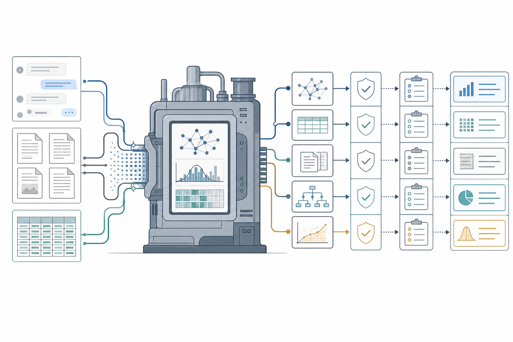
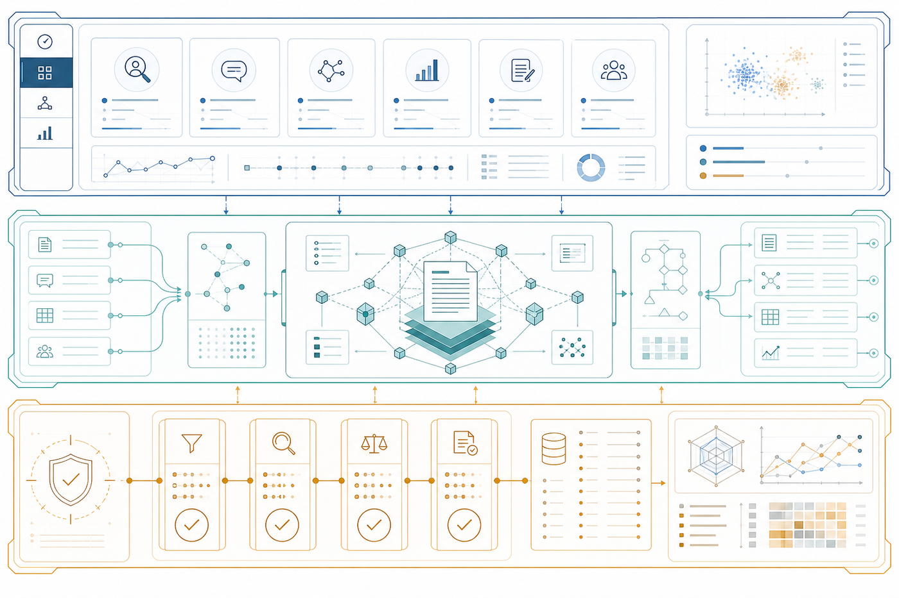
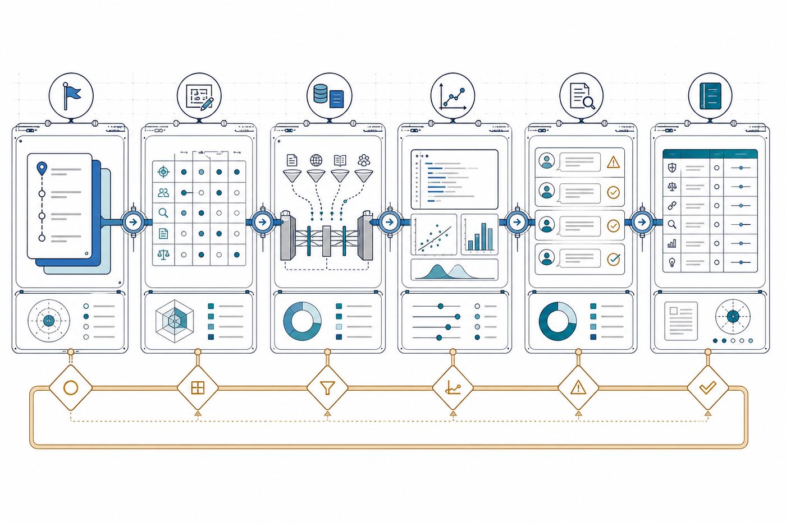
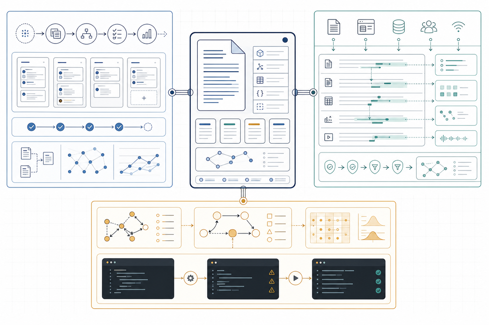
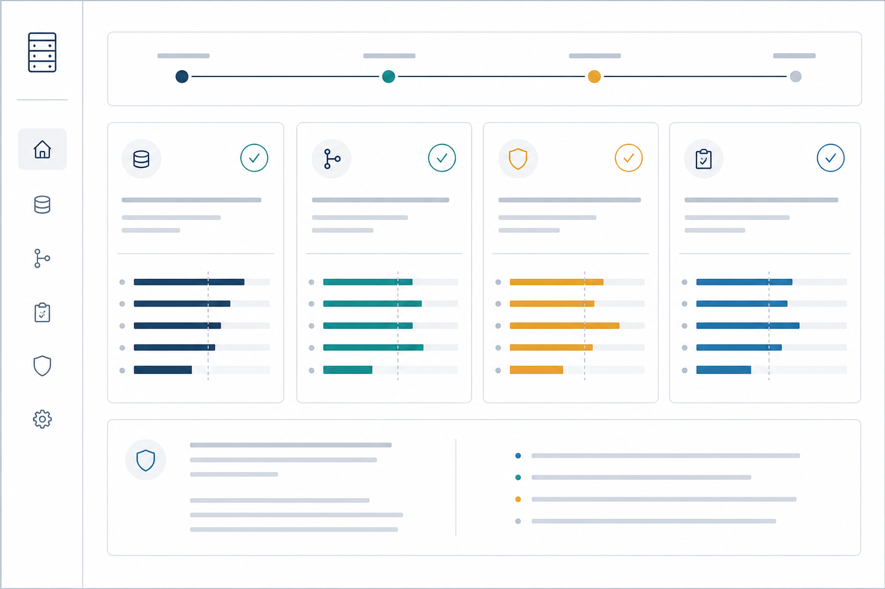

# README Visual Design Plan

This plan defines the next redesign of the `ai4ss-skills` GitHub homepage.
The goal is to move the README from a technically correct document to a
release-grade open-source landing page for the AI4SS research factory.

All README visual assets in this redesign should be generated with
`gpt-image-2`, committed as local image files, and referenced from Markdown.
The generated images should provide the visual identity, spatial layout, and
project feel. Precise terminology, numbers, links, commands, and evidence
claims must stay in Markdown text where they can be reviewed and tested.

## 1. Design Goal

The README must make a stranger understand, within the first screen, that this
repository is not a list of prompts or a loose skill library. It is a
methodology-enforcing research factory that turns agent conversations into
computable social-science research objects.

The desired first impression:

- This is a serious computational social-science infrastructure project.
- The system has a coherent architecture: skills, `.aiss`, validators, evals.
- The output is inspectable research state, not final scholarly prose.
- The project has evidence, boundaries, and a reproducible validation surface.
- The homepage looks intentionally designed, not assembled from raw tables.

## 2. Current README Diagnosis

The current README has the right conceptual direction but weak visual design.

Problems to fix:

1. The first screen has no visual anchor. It reads like documentation, not a
   launch page.
2. The project identity is still text-only. There is no image that says
   "research factory" at a glance.
3. The information density spikes too early: claim table, Mermaid diagram, DSL
   table, and sidecar list appear before the reader has a clear mental model.
4. `.aiss`, MIDA, sidecars, and validators are described as terms, not shown as
   a product architecture.
5. The evidence section is a table, not a visual trust surface.
6. The skills section still feels like a directory listing rather than a
   coordinated machine.

## 3. Design Principles

### 3.1 README-native design

The page must work inside GitHub Markdown. Avoid anything that depends on custom
CSS, JavaScript, external embeds, or a website runtime.

Use:

- Local PNG images generated with `gpt-image-2`.
- Markdown headings, tables, links, and `<details>` for precise information.
- Relative paths for images and links.
- Captions and adjacent text for labels that must be exact.

Avoid:

- External image hosting.
- Decorative image assets that do not explain the project.
- Relying on generated tiny text inside images for claims or commands.
- Long tables as the primary visual layout.
- CSS-dependent card grids.

### 3.2 Generated images, deterministic text

`gpt-image-2` should generate:

- hero atmosphere,
- system diagrams as visual metaphors,
- dashboard-like panels,
- workflow composition,
- icons and visual grouping.

Markdown should carry:

- `.aiss` and MIDA terminology,
- skill names,
- eval numbers,
- validation commands,
- boundaries,
- links and citations,
- installation instructions.

This split is deliberate. Generated images make the README beautiful and
memorable; Markdown keeps the research claims auditable.

### 3.3 Research instrument aesthetic

The visual language should feel like a trusted research instrument or factory
control panel:

- crisp lines,
- sober colors,
- high information value,
- visible gates and checks,
- no cartoon metaphors,
- no startup-style hero fluff,
- no generic robot or sparkle imagery.

### 3.4 Show the system before listing the parts

The README should first show the machine:

```text
conversation + sources + data
        -> AI4SS research factory
        -> .aiss object + gates + bounded handoff
```

Only after that should it list individual skills.

## 4. Visual Identity

### 4.1 Palette

Use a restrained, research-tool palette in every `gpt-image-2` prompt:

| Token | Hex | Use |
|---|---:|---|
| Ink | `#0f172a` | Main lines, controls, schematic frames |
| Slate | `#475569` | Secondary forms |
| Muted line | `#cbd5e1` | Connectors, dividers |
| Surface | `#f8fafc` | Light panels |
| Blue | `#2563eb` | Primary flow, `.aiss`, active path |
| Teal | `#0f766e` | Research object, verified artifacts |
| Amber | `#d97706` | Warning, boundary, author decision |
| Red | `#dc2626` | Blocked gate only, use sparingly |

The page should not become a one-hue blue site. Blue is for the factory path,
teal is for verified research state, amber is for limits and decisions.

### 4.2 Image style

Use this style direction in all prompts:

```text
serious editorial vector-like illustration, clean research infrastructure
control panel, white background, subtle grid, crisp thin lines, ink/slate/blue/
teal/amber palette, no logos, no humans, no robots, no decorative sparkles,
minimal or no readable text
```

Text inside generated images should be avoided or kept as abstract UI marks.
The README will provide exact labels and captions.

### 4.3 Shape vocabulary

Use consistent visual concepts across generated images:

| Concept | Visual motif |
|---|---|
| Source or input | document card, chat card, dataset panel |
| Skill | operator tile or workflow node |
| `.aiss` object | strong central research-object panel |
| Validator or gate | shield, diamond, or check node |
| Human decision | amber outlined decision card |
| Evidence object | stacked document card |
| Analysis output | terminal, chart, or manifest panel |
| Boundary | dashed frame |

## 5. Image Asset Plan

Create all README-specific images under:

```text
docs/assets/readme/
```

All images must be local PNG files generated with `gpt-image-2`. Use descriptive
filenames:

```text
docs/assets/readme/hero-factory.png
docs/assets/readme/factory-stack.png
docs/assets/readme/workflow-timeline.png
docs/assets/readme/aiss-object-map.png
docs/assets/readme/evidence-dashboard.png
```

Images should be optimized after generation so the repo does not carry
unnecessarily large assets.

### 5.1 `hero-factory.png`

Purpose:

The first-screen visual anchor. It must communicate the whole project before
the reader studies the text.

Target aspect:

```text
wide banner, approximately 3:1
```

Prompt intent:

```text
Wide editorial banner for a serious computational social-science research
infrastructure project. A clean research factory control panel: abstract chat
cards, source documents, dataset tables flowing into a central analytical
machine, then structured research objects, validation gates, manifests, and
bounded claims. White background, ink/slate/blue/teal/amber palette, crisp
professional vector-like style, no text, no letters, no logos, no robots, no
humans, no decorative sparkles.
```

README role:

This image appears above the title or immediately below it. Exact labels are in
the title and tagline, not inside the image.

### 5.2 `factory-stack.png`

Purpose:

Explain the project architecture as one coherent system.

Prompt intent:

```text
Clean technical architecture illustration for an AI-assisted social-science
research factory. Three horizontal layers in a research control-panel style:
operator interface layer, computable research object kernel layer, and trust
validation layer. Use abstract tiles, document nodes, a central kernel panel,
check gates, and ledger panels. White background, ink/slate/blue/teal/amber,
minimal fake UI text only, no real words, no logos, no people, no robots.
```

Markdown labels next to the image:

- Skills are the operator interface.
- `.aiss` is the computable research object.
- Validators, evals, and ledgers keep handoffs inspectable.

### 5.3 `workflow-timeline.png`

Purpose:

Replace a table-dominated workflow explanation with a scan-friendly visual.

Prompt intent:

```text
Wide horizontal workflow timeline for a social-science research factory. Six
connected stages represented as elegant research-instrument panels: start,
design, data and literature, analysis, review, report. Use icons for route
cards, methodology matrix, source/data gates, scripts and charts, issue review,
bounded claim ledger. White background, crisp vector-like style, blue/teal flow
line, amber author decision accents, no readable text, no logos, no people.
```

README labels should name the six stages and skills precisely in Markdown.

### 5.4 `aiss-object-map.png`

Purpose:

Make `.aiss` look like the product kernel instead of an internal acronym.

Prompt intent:

```text
Technical concept map for a computable research object at the center of an
AI-assisted social-science workflow. Central glowing but sober document-kernel
panel connected to three regions: workflow lifecycle, evidence grounding, and
research model. Use abstract document cards, source spans, model nodes, causal
bridges, check gates, and compile-lint-run terminal panels. White background,
precise schematic linework, ink/slate/blue/teal/amber palette, no readable
text, no logos, no people.
```

README text should explain:

- one AST for workflow, evidence, and model regions,
- deterministic `compile`, `lint`, `run`,
- sidecars are readable projections, not a second workflow language.

### 5.5 `evidence-dashboard.png`

Purpose:

Turn the evaluation section into a visual trust dashboard.

Prompt intent:

```text
Clean evidence dashboard illustration for a serious open-source research
infrastructure project. Four metric cards with abstract bar comparisons and
check indicators, plus a subtle boundary note area. Professional white
dashboard, ink/slate/blue/teal/amber palette, no readable numbers or words, no
logos, no people. The feeling should be audit-ready, not salesy.
```

Markdown must show exact numbers:

| Card | Main number | Comparison | Label |
|---|---:|---|---|
| Factory structural packet | 91.4 | vs 7.3 baseline | full-chain continuity |
| Live skill-use evaluation | 94.1 | vs 84.4 baseline | inspectable artifacts |
| Structural skill simulation | 96.2 | vs 39.0 baseline | canonical gates |
| Cleaning-contract benchmark | 100% | vs 53% baseline | real PI survey tasks |

Every evidence section must state:

```text
These evaluations measure structure, continuity, validation gates, and boundary
discipline. They do not prove empirical truth or replace expert review.
```

## 6. README Layout Plan

### 6.1 Top hero

Markdown skeleton:

```markdown
<div align="center">



# ai4ss-skills

### Turn agent conversations into computable social-science research objects.

[badges]

**[Start](#start) | [Factory](#factory) | [Evidence](#evidence) | [Validate](#validate)**

</div>
```

### 6.2 One-screen value proposition

Section title:

```markdown
## From Chat Output To Research State
```

Use a compact two-column table:

| Chat output | AI4SS research state |
|---|---|
| prose plan | route and MIDA declarations |
| cleaned data claim | DDI metadata, contract, audit |
| literature summary | source ledger, extraction matrix |
| model result | readiness gate, scripts, manifest |
| final-sounding answer | bounded claim ledger |

### 6.3 Reader paths

Section title:

```markdown
## Choose Your Path
```

Three columns:

| Try it | Understand it | Audit it |
|---|---|---|
| install and run first prompt | read factory stack and `.aiss` map | inspect evals and validators |

### 6.4 Factory architecture

Section title:

```markdown
## Factory Architecture
```

Insert:

```markdown

```

Then 3 bullets:

- Skills are the operator interface.
- `.aiss` is the computable research object.
- Validators, evals, and ledgers keep handoffs inspectable.

### 6.5 Workflow timeline

Section title:

```markdown
## Research Workflow
```

Insert:

```markdown

```

Follow with a compact table naming stages, skills, artifacts, and gates.

### 6.6 `.aiss` kernel section

Section title:

```markdown
## The `.aiss` Research Object
```

Insert:

```markdown

```

Then show one short code block, not a long DSL explanation:

```aiss
aiss version "0.4"

route demo.route_r1 { ... }
mida demo.mida_r1_model { ... }
decision demo.decision_r1_identification { ... }
check demo.check_reference_integrity { ... }
```

### 6.7 Skills section

Section title:

```markdown
## Skills
```

Visible part:

- Show only the research-factory chain as a compact table.
- Keep specialist skills in `<details>`.

### 6.8 Evidence dashboard

Section title:

```markdown
## Evidence
```

Insert:

```markdown

```

Then show exact metrics in Markdown and link the reports.

### 6.9 Start, validate, boundaries, cite

Keep these sections mostly textual:

- `Start`
- `Validate`
- `Boundaries`
- `Repository Layout`
- `Contributing`
- `Cite`
- `License`

Do not add decorative images here. These are trust and maintenance sections.

## 7. Copy Hierarchy

### 7.1 New tagline

Preferred:

```text
Turn agent conversations into computable social-science research objects.
```

### 7.2 Short project definition

Use this near the top:

```text
`ai4ss-skills` is a methodology-enforcing research factory. Skills are the
operator interface; `.aiss` is the computable research object; validators and
eval packets keep the handoff inspectable.
```

### 7.3 Words to avoid

Avoid:

- "AI writes your paper",
- "fully automated research",
- "proves validity",
- "double-blind" unless the evaluation is actually double-blind,
- exaggerated product claims.

Use:

- "inspectable",
- "bounded",
- "author decision",
- "research object",
- "validation gate",
- "handoff",
- "workflow contract".

## 8. Implementation Steps

### Step 1: Create asset directory

```text
docs/assets/readme/
```

### Step 2: Generate PNG assets with `gpt-image-2`

Generate:

```text
docs/assets/readme/hero-factory.png
docs/assets/readme/factory-stack.png
docs/assets/readme/workflow-timeline.png
docs/assets/readme/aiss-object-map.png
docs/assets/readme/evidence-dashboard.png
```

Requirements:

- generated with `gpt-image-2`,
- committed as local PNG files,
- no external image references,
- no generated image required to carry exact text,
- optimized file size,
- visually inspected before use.

### Step 3: Rewrite README layout

Replace the current README structure with the plan in Section 6.

Preserve:

- correct repo positioning,
- install script,
- validation commands,
- evidence numbers,
- no-final-prose boundary,
- unified `skills/` tree rule,
- cite and license.

Reduce:

- long early tables,
- repeated internal architecture explanation,
- dense skill catalog on the first pass.

### Step 4: Update AI-use ledger

Append one row to:

```text
docs/ai_use_ledger.csv
```

The row should say that Codex redesigned the README with `gpt-image-2` local
visual assets, factory architecture, workflow timeline, `.aiss` object map,
evidence dashboard, and unchanged research-boundary claims.

### Step 5: Validate

Run:

```bash
python3 scripts/validate_ai_use_ledger.py docs/ai_use_ledger.csv
git diff --check
```

Also run a README path check:

```bash
python3 - <<'PY'
import pathlib, re, sys
root = pathlib.Path(".")
text = pathlib.Path("README.md").read_text()
links = re.findall(r"(?<!!)\\[[^\\]]*\\]\\(([^)]+)\\)", text)
images = re.findall(r"!\\[[^\\]]*\\]\\(([^)]+)\\)", text)
missing = []
for link in links + images:
    if link.startswith(("http://", "https://", "#")):
        continue
    path = link.split("#", 1)[0]
    if path and not (root / path).exists():
        missing.append(link)
if missing:
    print("Missing README paths:")
    for item in missing:
        print(item)
    sys.exit(1)
print(f"PASS README paths: {len(links)} links, {len(images)} images")
PY
```

Run broader factory checks if README wording changes claims about validation or
evaluation:

```bash
python3 scripts/validate_skillpack_workflow.py
python3 scripts/validate_methodology_foundations.py docs/methodology_source_matrix.csv
python3 scripts/validate_ai4ss_model.py docs/examples/research_model.aiss
python3 scripts/validate_literature_evidence_compile.py skills/literature-matrix/examples/valid_literature_matrix.csv
python3 scripts/validate_analysis_readiness.py skills/research-analysis-runner/examples/valid_analysis_readiness_check.csv
python3 scripts/run_factory_level_eval.py --clean
```

## 9. Acceptance Checklist

The redesign is complete only if:

- The plan explicitly requires `gpt-image-2` for README visual assets.
- The first screen contains a strong generated hero image.
- A reader can explain the system after scanning the hero and factory stack.
- `.aiss` is visually presented as the project kernel.
- The workflow is shown with a generated visual timeline plus exact Markdown
  labels.
- Evidence is shown with a generated dashboard plus exact Markdown metrics and
  explicit limits.
- The skills section reads as one factory chain, not a scattered directory.
- Specialist skills are available but visually secondary.
- All image paths are local and checked.
- README path check passes.
- `git diff --check` passes.
- `validate_ai_use_ledger.py` passes.
- Broader factory validation passes when claims or workflow text change.
- No claims imply that validators prove empirical truth or replace expert
  review.

## 10. Risks And Controls

| Risk | Control |
|---|---|
| Generated text is wrong or illegible | Prompt for no readable text; put exact text in Markdown |
| Image assets are too large | Optimize PNGs after generation |
| README becomes too image-heavy | Every image must replace a dense explanation, not duplicate it |
| Marketing tone overstates evidence | Put limits directly under the evidence dashboard |
| Skills look scattered again | Show the factory chain first; utilities go in `<details>` |
| Diagram language drifts from repo truth | Source Markdown labels from `docs/skillpack_workflow_contract.md` and `docs/ai4ss_dsl_factory_integration.md` |

## 11. Expected Diff

Expected changed or added files:

```text
README.md
DESIGNPLAN.md
docs/assets/readme/hero-factory.png
docs/assets/readme/factory-stack.png
docs/assets/readme/workflow-timeline.png
docs/assets/readme/aiss-object-map.png
docs/assets/readme/evidence-dashboard.png
docs/ai_use_ledger.csv
```

This plan should remain committed with the visual redesign so future README
work can preserve the same asset strategy.
