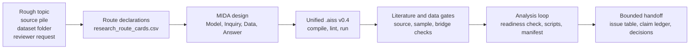

<div align="center">

# ai4ss-skills

### From agent conversation to a computable social-science research object

AI assistance for social science should not end as a plausible paragraph in a
chat window. This repository turns rough ideas, source piles, datasets, and
reviewer comments into inspectable research objects: `.aiss` declarations, MIDA
design rows, evidence and data gates, analysis manifests, claim ledgers, and
author decision points.

[](LICENSE)
[](https://python.org)
[](https://www.r-project.org/)
[](https://docs.anthropic.com/en/docs/claude-code/skills)
[](https://cursor.com)

**[Start](#start) | [Factory](#factory) | [Artifacts](#artifacts) | [Skills](#skills) | [Evidence](#evidence) | [Validate](#validate) | [Boundaries](#boundaries)**

</div>

---

## The Claim

`ai4ss-skills` is not a prompt collection and not a paper-writing bot.

It is a methodology-enforcing research factory for computational social
scientists. Skills are the user-facing entrypoints; the actual product is a
research state that can be compiled, linted, inspected, routed to the next
workbench, and handed back to the author without pretending that the AI owns the
scholarly judgment.

| What agents usually leave behind | What this repository makes them leave behind |
|---|---|
| A polished but fragile research plan | Stable route, MIDA, and decision declarations |
| "I cleaned the data" | DDI metadata, cleaning contract, execution audit, sample flow |
| Literature notes in prose | Source ledger, extraction matrix, compiled `.aiss` evidence |
| Tables with unclear provenance | Readiness gate, scripts, logs, analysis manifest |
| Confident interpretation | Issue table, claim ledger, explicit author decision point |

The ambition is simple: make AI useful before it writes prose, and make every
important intermediate object visible enough for a scholar to accept, reject,
revise, rerun, or cite.

## Factory



The methodology spine is shared across the whole skillpack:

```text
Declare MIDA -> Diagnose -> Redesign -> Report with bounded claims
```

MIDA means:

| Element | What must become explicit |
|---|---|
| Model | Units, constructs, mechanisms, assumptions, scope conditions |
| Inquiry | Causal estimand, descriptive quantity, measurement target, classification target, process-tracing claim, or synthesis question |
| Data strategy | Sampling, source selection, measurement, extraction, linkage, missingness, and source-screening rules |
| Answer strategy | Estimator, coding rule, synthesis rule, diagnostic comparison, table or figure shell, or qualitative inference procedure |

## Artifacts

The factory has three coordinated layers.

| Layer | Location | Role |
|---|---|---|
| User-facing skills | [`skills/`](skills/README.md) | Task entrypoints for agents and researchers |
| Computable research object | [`dsl/`](dsl/scripts/aiss.py), [`references/dsl/dsl-spec.md`](references/dsl/dsl-spec.md) | `.aiss` v0.4 parser, compiler, linter, runner, and DSL spec |
| Trust and evaluation surface | [`scripts/`](scripts/), [`docs/`](docs/) | Validators, workflow contracts, methodology foundations, evaluation packets, AI-use ledger |

### `.aiss` v0.4

`.aiss` compiles into `aiss.unified_ast.v0.4`, one AST with connected workflow,
evidence, and model regions:

| Region | Declarations | Purpose |
|---|---|---|
| Workflow lifecycle | `route`, `mida`, `decision` | Candidate routes, selected design, author-owned choices, handoff state |
| Evidence and discourse grounding | `paper`, `source`, `span`, `claim`, `relation`, `empirical`, `observation`, `coupling`, `artifact`, `adapter` | Source spans, claims, empirical material, and discourse links |
| Research model | `attribute`, `concept`, `causal`, `bridge`, `edge`, `model`, `check`, `derive` | Constructs, causal or measurement bridges, requested checks, derived diagnostics |

Run the deterministic entrypoint:

```bash
python3 dsl/scripts/aiss.py compile docs/examples/research_model.aiss
python3 dsl/scripts/aiss.py lint docs/examples/research_model.aiss
python3 dsl/scripts/aiss.py run docs/examples/research_model.aiss
```

### Human-readable sidecars

Sidecars are not a second workflow language. They are readable projections of
the same research state, made for inspection, teaching, validation, and handoff:

```text
research_route_cards.csv
study_design_declaration.csv
design_decision_register.csv
ddi-metadata.yaml
sample_flow.csv
literature_matrix.csv
analysis_readiness_check.csv
analysis_run_manifest.csv
issue_table.csv
claim_ledger.csv
revision_matrix.csv
```

## Start

Install every skill into Claude Code:

```bash
git clone https://github.com/SiyaoZheng/ai4ss-skills.git
mkdir -p ~/.claude/skills

for s in ai4ss-skills/skills/*; do
  [ -f "$s/SKILL.md" ] || continue
  name=$(basename "$s")
  rm -rf ~/.claude/skills/"$name"
  cp -R "$s" ~/.claude/skills/"$name"
done
```

Then start with a research-factory prompt:

```text
Use research-starter. I have a rough topic: city digital-government platforms
and firm green innovation. Create candidate research routes, stop reasons, and
the next executable research action. Do not write manuscript prose.
```

Or begin from a data bottleneck:

```text
Parse this survey codebook into DDI metadata. Treat missing codes per variable;
do not globally recode positive values as missing.
```

## Workbenches

| Stage | Scholar question | Primary skill | Canonical artifact | Gate |
|---|---|---|---|---|
| 0. Start | Can this become a study? | [`research-starter`](skills/research-starter/SKILL.md) | `.aiss` `route` declarations, route cards | Stop reason, missing material, next route |
| 1. Design | What is the executable design? | [`study-design-builder`](skills/study-design-builder/SKILL.md) | selected route, seven `mida` declarations, decisions | Complete MIDA and author choices |
| 2a. Data | Where did the data and sample come from? | [`research-data-builder`](skills/research-data-builder/SKILL.md) | sample flow, merge audit, variable provenance | Data contract and audit trail |
| 2b. Literature | Are sources verified and usable? | [`literature-matrix`](skills/literature-matrix/SKILL.md) | candidate discovery, source matrix, compiled evidence | Source status and extraction checks |
| 3. Analysis | Can the first results be run and checked? | [`research-analysis-runner`](skills/research-analysis-runner/SKILL.md) | readiness check, scripts, logs, manifest | Readiness and design linkage |
| 4. Review | Is the interpretation overreaching? | [`methods-reviewer`](skills/methods-reviewer/SKILL.md) | issue table, recommended checks | Method/data/claim alignment |
| 5. Report | How can the author write safely? | [`academic-writing-scaffold`](skills/academic-writing-scaffold/SKILL.md), [`research-slides-builder`](skills/research-slides-builder/SKILL.md), [`reviewer-response`](skills/reviewer-response/SKILL.md) | claim ledger, slide map, revision matrix | Bounded claims and author decisions |

## Skills

All installable skills live in one canonical tree:

```text
skills/<skill-name>/SKILL.md
```

`.codex/skills` and `.agents/skills` are symlinks to that same source tree.
There is no second skin for Codex, Agents, or released skill archives.

### Research-factory skills

| Skill | Owns |
|---|---|
| [`research-starter`](skills/research-starter/SKILL.md) | Candidate routes, minimum viable study, next executable action |
| [`study-design-builder`](skills/study-design-builder/SKILL.md) | Selected route, seven MIDA declarations, decision register, `.aiss` model/check |
| [`research-data-builder`](skills/research-data-builder/SKILL.md) | Data pipeline, sample flow, merge audit, variable provenance |
| [`literature-matrix`](skills/literature-matrix/SKILL.md) | Literature discovery, source screening, extraction matrix, compiled evidence |
| [`research-analysis-runner`](skills/research-analysis-runner/SKILL.md) | Analysis readiness gate, first-pass outputs, analysis manifest |
| [`methods-reviewer`](skills/methods-reviewer/SKILL.md) | Method, data, answer, and claim alignment diagnostics |
| [`academic-writing-scaffold`](skills/academic-writing-scaffold/SKILL.md) | Claim ledger and section scaffold without final prose |
| [`research-slides-builder`](skills/research-slides-builder/SKILL.md) | Slide map, source map, visual evidence boundaries |
| [`reviewer-response`](skills/reviewer-response/SKILL.md) | Revision matrix and author-fillable response scaffold |

### Specialist and utility skills

| Skill | Owns |
|---|---|
| [`codebook-parse`](skills/codebook-parse/SKILL.md) | DDI survey metadata SSOT from data and codebooks |
| [`cleaning-contract`](skills/cleaning-contract/SKILL.md) | Declared cleaning decisions before transformation |
| [`cleaning-execute`](skills/cleaning-execute/SKILL.md) | Mechanical execution of a declared cleaning contract |
| [`did-expert`](skills/did-expert/SKILL.md) | DID and panel causal inference diagnostics |
| [`latex-tables`](skills/latex-tables/SKILL.md) | Publication-style LaTeX tables |
| [`analysis-explainer`](skills/analysis-explainer/SKILL.md) | Technical result documentation for collaborators |
| [`r-performance`](skills/r-performance/SKILL.md) | R profiling, optimization, and HPC-oriented performance advice |
| [`sjtu-hpc`](skills/sjtu-hpc/SKILL.md) | SJTU HPC and Slurm workflow guidance |
| [`codex`](skills/codex/SKILL.md) | OpenAI Codex CLI delegation from another agent |
| [`linear-issue`](skills/linear-issue/SKILL.md) | Work tracking through Linear issues |

## Evidence

The evidence claim is deliberately narrow. These checks show structure,
continuity, validation gates, and boundary discipline. They do not prove that an
empirical claim is true or that expert review is unnecessary.

| Evaluation | Baseline | AI4SS skill/factory | What it measures |
|---|---:|---:|---|
| Factory-level structural packet | 7.3 / 100 | 91.4 / 100 | Full-chain continuity from rough topic to bounded claim handoff |
| Live skill-use evaluation | 84.4 / 100 | 94.1 / 100 | Inspectable artifacts, traceability markers, validation gates, author decisions |
| Structural skill-use simulation | 39.0 / 100 | 96.2 / 100 | Whether canonical artifacts and gates appear in controlled packets |
| Cleaning-contract benchmark | 53% pass rate | 100% pass rate | Survey cleaning contracts on three real PI datasets |

Key reports:

- [`docs/factory_level_eval/unblinded_report.md`](docs/factory_level_eval/unblinded_report.md)
- [`docs/live_blind_skill_use_eval/unblinded_report.md`](docs/live_blind_skill_use_eval/unblinded_report.md)
- [`docs/blind_skill_use_eval/unblinded_report.md`](docs/blind_skill_use_eval/unblinded_report.md)
- [`docs/evals/cleaning-contract/iteration-1/benchmark.md`](docs/evals/cleaning-contract/iteration-1/benchmark.md)

## Validate

Run the current factory checks from the repository root:

```bash
python3 scripts/validate_skillpack_workflow.py
python3 scripts/validate_methodology_foundations.py docs/methodology_source_matrix.csv
python3 scripts/validate_ai_use_ledger.py docs/ai_use_ledger.csv
python3 scripts/validate_ai4ss_model.py docs/examples/research_model.aiss
python3 scripts/validate_literature_evidence_compile.py skills/literature-matrix/examples/valid_literature_matrix.csv
python3 scripts/validate_analysis_readiness.py skills/research-analysis-runner/examples/valid_analysis_readiness_check.csv
python3 scripts/run_factory_level_eval.py --clean
```

## Boundaries

This project is deliberately not a paper-writing bot.

- It must not write final manuscript prose for the author.
- It must not write final reviewer-response prose for the author.
- It must not treat deterministic structural checks as live peer review.
- It must not turn `.aiss` checker success into identification validity.
- It must preserve missing data, source uncertainty, diagnosed limits, and
  author decisions.
- It is a methodology-enforcing workflow, not a complete specialist-methods
  system for every empirical design.

## Repository Layout

```text
.
|-- skills/                 # canonical source tree for every installable skill
|-- dsl/                    # .aiss parser, compiler, linter, and runner
|-- docs/                   # workflow contracts, methodology docs, eval packets
|-- scripts/                # validators and evaluation generators
|-- references/             # source and DSL reference material
|-- .codex/skills -> ../skills
`-- .agents/skills -> ../skills
```

## Contributing

Add a skill when you can name a real research failure mode and turn it into a
repeatable artifact workflow.

A good contribution should:

1. live under `skills/<skill-name>/`,
2. include a `SKILL.md` with precise trigger language,
3. define its methodology role in the MIDA spine,
4. preserve upstream handoff fields when available,
5. produce inspectable artifacts rather than final scholarly claims,
6. add examples or validators when the output has a schema.

## Cite

```bibtex
@software{ai4ss_skills_2026,
  author    = {Zheng, Siyao},
  title     = {ai4ss-skills: Agent Skills for Social Science Research},
  year      = {2026},
  url       = {https://github.com/SiyaoZheng/ai4ss-skills},
  note      = {Released at AI for Social Science (AI4SS) Online Lecture Series}
}
```

## License

GPL-3.0. Derivative works must carry the same license.

Exception: `skills/codex/` is based on
[@davila7](https://github.com/davila7)'s original Codex skill and retains its
MIT license in [`skills/codex/LICENSE`](skills/codex/LICENSE).
