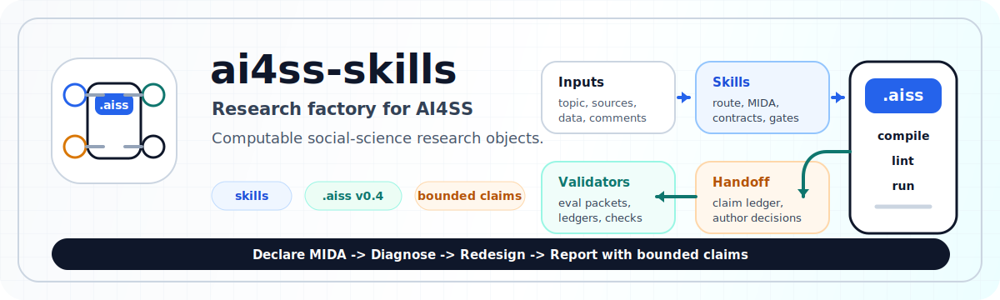

<p align="center">
  
</p>

<div align="center">

# ai4ss-skills

### Research infrastructure for agent-assisted social science.

AI4SS turns agent work into durable research objects: route declarations,
study designs, source-evidence declarations, data contracts, analysis artifacts,
methods diagnostics, bounded claims, presentation artifacts, and reviewer
decision traces.

It treats the model as a worker inside a research operating system, not as the
operating system itself.

[](LICENSE)
[](https://python.org)
[](https://www.r-project.org/)
[](.codex-plugin/plugin.json)
[](.claude-plugin/plugin.json)

**[Install](#install) | [Workflow](#workflow) | [Skills](#skills) | [Validation](#validation) | [Evidence](#evidence) | [Boundaries](#boundaries)**

</div>

<table>
  <tr>
    <td align="center"><strong>19</strong><br>installable skills</td>
    <td align="center"><strong>.aiss v0.4</strong><br>research object IR</td>
    <td align="center"><strong>12</strong><br>workflow gates</td>
    <td align="center"><strong>4</strong><br>evaluation tracks</td>
    <td align="center"><strong>78.7 / 100</strong><br>factory structural score</td>
  </tr>
</table>

## What This Is

AI agents are already good at producing fluent research-shaped text. That is
not the hard part. The hard part is making agent work usable inside scholarship
without losing the things research depends on: source status, design choices,
data lineage, missingness decisions, analysis readiness, methods review,
authorship boundaries, and revision traceability.

This repository is a working infrastructure layer for that problem. It combines
installable agent skills, a unified `.aiss` research object, validators,
examples, and evaluation packets. The goal is not to make an agent sound like a
scholar. The goal is to make its work inspectable enough that a scholar can use,
reject, revise, teach, and extend it.

| AI failure mode | AI4SS response |
|---|---|
| Plausible topic advice with no next action | `.aiss` route declarations, stop reasons, minimum viable study |
| "Research design" reduced to a slogan | MIDA declarations, decision registers, diagnosands |
| Literature review as unsourced synthesis | `.aiss` source-evidence declarations and source-status gates |
| Data cleaning remembered in prose | DDI metadata, cleaning contract, execution audit, `.aiss` row-loss checks |
| Tables detached from design | `.aiss` readiness checks, scripts, logs, analysis artifacts |
| Methods issues found too late | `.aiss` diagnostic checks, redesign routes, validation commands |
| Writing help that hides AI involvement | Bounded claim declarations, AI-use disclosure, paragraph drafts, submission gate |
| Reviewer response without traceability | Reviewer-request decisions, manuscript locations, action status |

The core claim is infrastructural: agent-assisted social science needs durable
research objects and quality gates, not only better prompts.

## Install

Clone the repository:

```bash
git clone https://github.com/SiyaoZheng/ai4ss-skills.git
cd ai4ss-skills
```

### Codex

The Codex plugin wrapper lives at `.codex-plugin/plugin.json` and points at the
canonical `skills/` tree. The local marketplace entry is
`.agents/plugins/marketplace.json`.

```bash
codex plugin marketplace add /path/to/ai4ss-skills
codex plugin add ai4ss-skills@ai4ss-skills-local
```

Validate the Codex wrapper:

```bash
python3 scripts/validate_codex_plugin.py
```

### Claude Code

The Claude Code plugin wrapper lives at `.claude-plugin/plugin.json` and points
at the same canonical `skills/` tree. The local marketplace entry is
`.claude-plugin/marketplace.json`.

```bash
claude plugin marketplace add /path/to/ai4ss-skills
claude plugin install ai4ss-skills@ai4ss-skills-local
```

Validate the Claude Code wrapper:

```bash
python3 scripts/validate_claude_plugin.py
claude plugin validate --strict .claude-plugin/plugin.json
claude plugin validate --strict .claude-plugin/marketplace.json
```

### Direct Skill Installs

Plugin install is the preferred path. If a runtime only supports directory
skills, copy or symlink selected `skills/<skill-name>/` directories into that
runtime's skill directory.

The repository-local `.codex/skills` and `.agents/skills` entries are symlinks
to `../skills`. They are convenience links for local development, not a second
source tree.

## Workflow

The research-factory spine is:

```text
rough topic -> .aiss route declarations -> .aiss MIDA declarations ->
literature/data gates -> .aiss analysis readiness -> .aiss analysis artifacts ->
transparency package -> bounded claim handoff -> AI-disclosed manuscript package
```

The methodology spine is:

```text
Declare MIDA -> Diagnose -> Redesign -> Report with bounded claims
```

In practice:

| Stage | Scholar question | Primary skill | Durable output |
|---|---|---|---|
| Start | What can this become? | `research-starter` | `.aiss` route declarations, stop reason, next executable action |
| Design | What exactly is the study? | `study-design-builder` | Selected route, MIDA declarations, decision register, `.aiss` model/check |
| Data | Can the data support the design? | `research-data-builder` | `.aiss` source/artifact/empirical declarations, row-loss checks, data pipeline |
| Literature | What is the source-backed evidence? | `literature-matrix` | `.aiss` source-evidence declarations and source-status checks |
| Analysis | Is this ready to run? | `research-analysis-runner` | `.aiss` readiness checks, scripts, outputs, analysis artifacts |
| Review | Are method and claim aligned? | `methods-reviewer` | Issues, redesign options, author decisions |
| Report/package | How does the author communicate and submit safely? | `academic-writing-scaffold`, `research-slides-builder`, `reviewer-response` | Bounded claims, source map, TOP disclosure matrix, replication-package status, presentation artifacts, reviewer decisions |

The workflow is a relay, not a chain of prose requests. Each stage should
preserve identifiers, source paths, known gaps, validation commands, and
interpretation boundaries so the next stage can inspect what happened.

## Core Objects

AI4SS has five working layers.

| Layer | What it does | Where to look |
|---|---|---|
| Skill layer | Gives agents task-specific operating procedures | [`skills/`](skills/) |
| Research object layer | Stores route, design, source, evidence, model, bridge, check, and decision state | [`docs/examples/research_model.aiss`](docs/examples/research_model.aiss) |
| Source artifact layer | Keeps cited PDFs, logs, scripts, tables, figures, and author notes outside workflow state | project source folders |
| Gate layer | Checks workflow contracts, readiness, evidence, `.aiss` validity, and ledgers | [`scripts/`](scripts/) |
| Evidence layer | Runs structural evals and benchmarks | [`docs/factory_level_eval/`](docs/factory_level_eval/) |

### `.aiss`

The local `.aiss` version `0.4` object compiles to
`aiss.unified_ast.v0.4`. It can carry:

- `route` declarations
- seven MIDA declarations
- `decision` declarations
- source spans
- claims, concepts, attributes, causal relations, empirical objects, and bridges
- checks, transparency status, replication-package status, and derived diagnostics

CSV files, YAML files, and derived Markdown notes are not workflow state.
Agents may reference external source artifacts from `.aiss`, but handoff
contracts must live in checked `.aiss` declarations.

### MIDA

MIDA keeps design work concrete:

| Component | Minimum meaning |
|---|---|
| Model | Units, constructs, mechanisms, assumptions, scope conditions |
| Inquiry | Causal estimand, descriptive quantity, measurement target, classification target, process-tracing claim, or synthesis question |
| Data strategy | Sampling, source selection, measurement, extraction, linkage, missingness, and source-screening rules |
| Answer strategy | Estimator, coding rule, synthesis rule, diagnostic comparison, table shell, or qualitative inference procedure |
| Diagnose | Bias, precision, measurement risk, source-status risk, row loss, reproducibility, and claim-support mismatch |
| Redesign | Smaller first loop, revised measure, added source, changed estimator, stronger comparison, or abandoned route |
| Report boundary | Claim ledger, source map, AI-use ledger, transparency disclosures, replication-package status, author decision point, and communication boundary |

## Skills

All installable skills live under `skills/<skill-name>/`. `skills/` is the only
source tree.

### Research Factory Skills

| Skill | When to use it | Owns |
|---|---|---|
| [`research-starter`](skills/research-starter/SKILL.md) | Rough topic, source pile, vague policy phenomenon, or "what can I do next?" | `.aiss` route declarations, minimum viable study, next action |
| [`study-design-builder`](skills/study-design-builder/SKILL.md) | Turn a selected route into an executable design | MIDA declarations, estimand map, decision register, `.aiss` model/check |
| [`research-data-builder`](skills/research-data-builder/SKILL.md) | Build or repair an auditable analysis sample | Data pipeline plus `.aiss` source/artifact/empirical/check declarations |
| [`literature-matrix`](skills/literature-matrix/SKILL.md) | Discover, screen, and extract source-backed literature evidence | Candidate discovery, screening/extraction matrix, compiled evidence |
| [`research-analysis-runner`](skills/research-analysis-runner/SKILL.md) | Run first-pass outputs after readiness checks | `.aiss` readiness checks, scripts, tables, figures, logs, analysis artifacts |
| [`methods-reviewer`](skills/methods-reviewer/SKILL.md) | Audit design, data, answer, and claim alignment | Methods issues, redesign routes, author decisions |
| [`academic-writing-scaffold`](skills/academic-writing-scaffold/SKILL.md) | Prepare AI-disclosed manuscript work | Claim ledger, argument map, paragraph slots, working drafts, citation gaps, submission gate |
| [`research-slides-builder`](skills/research-slides-builder/SKILL.md) | Convert verified evidence into presentation structure | Slide map, source map, visual result narrative |
| [`reviewer-response`](skills/reviewer-response/SKILL.md) | Convert reviews into a traceable revision plan | Revision matrix, manuscript locations, response scaffold |

### Specialist And Tooling Skills

| Skill | Owns |
|---|---|
| [`codebook-parse`](skills/codebook-parse/SKILL.md) | DDI survey metadata SSOT from data and codebooks |
| [`cleaning-contract`](skills/cleaning-contract/SKILL.md) | Declared recoding decisions before data transformation |
| [`cleaning-execute`](skills/cleaning-execute/SKILL.md) | Mechanical execution of a declared cleaning contract |
| [`did-expert`](skills/did-expert/SKILL.md) | DID and panel causal inference diagnostics |
| [`latex-tables`](skills/latex-tables/SKILL.md) | Publication-style LaTeX tables and HTML previews |
| [`analysis-explainer`](skills/analysis-explainer/SKILL.md) | Technical result documentation for collaborators |
| [`r-performance`](skills/r-performance/SKILL.md) | R profiling, optimization, and parallelization advice |
| [`sjtu-hpc`](skills/sjtu-hpc/SKILL.md) | SJTU HPC, Slurm, queues, transfer, cleanup, and job templates |
| [`codex`](skills/codex/SKILL.md) | OpenAI Codex CLI delegation from another agent |
| [`linear-issue`](skills/linear-issue/SKILL.md) | Work tracking through Linear issues |

## Validation

Run the full validation suite from the repository root after changing the
research-factory skillpack:

```bash
python3 scripts/validate_skillpack_workflow.py
python3 scripts/validate_methodology_foundations.py docs/methodology_source_matrix.csv
python3 scripts/validate_ai_use_ledger.py docs/ai_use_ledger.csv
python3 scripts/validate_ai4ss_model.py docs/examples/research_model.aiss
python3 scripts/run_factory_level_eval.py --clean
```

Run plugin wrapper validation after changing package metadata:

```bash
python3 scripts/validate_codex_plugin.py
python3 scripts/validate_claude_plugin.py
claude plugin validate --strict .claude-plugin/plugin.json
claude plugin validate --strict .claude-plugin/marketplace.json
```

For DSL work, use the unified v0.4 entrypoint:

```bash
python3 dsl/scripts/aiss.py compile docs/examples/research_model.aiss
python3 dsl/scripts/aiss.py lint docs/examples/research_model.aiss
python3 dsl/scripts/aiss.py run docs/examples/research_model.aiss
```

Key contracts:

- [`docs/skillpack_workflow_contract.md`](docs/skillpack_workflow_contract.md)
- [`docs/ai4ss_dsl_factory_integration.md`](docs/ai4ss_dsl_factory_integration.md)
- [`docs/methodology_foundations.md`](docs/methodology_foundations.md)
- [`docs/methodology_source_matrix.csv`](docs/methodology_source_matrix.csv)
- [`docs/ai_use_ledger.schema.md`](docs/ai_use_ledger.schema.md)
- [`docs/skillpack_gap_map.md`](docs/skillpack_gap_map.md)

## Evidence

These evaluations measure structure, continuity, validation gates, and boundary
discipline. They do not prove empirical truth and they do not replace expert
review.

| Evaluation | Baseline | AI4SS skill/factory | What it measures |
|---|---:|---:|---|
| Factory-level structural packet | 5.5 / 100 | 78.7 / 100 | Continuity from rough topic to AI-disclosed manuscript package |
| Live skill-use evaluation | 84.4 / 100 | 94.1 / 100 | Inspectable artifacts, traceability markers, validation gates, author decisions |
| Structural skill-use simulation | 39.0 / 100 | 96.2 / 100 | Whether canonical artifacts and gates appear in controlled packets |
| Cleaning-contract benchmark | 53% pass rate | 100% pass rate | Survey cleaning contracts on three real PI datasets |

Reports:

- [`docs/factory_level_eval/unblinded_report.md`](docs/factory_level_eval/unblinded_report.md)
- [`docs/live_blind_skill_use_eval/unblinded_report.md`](docs/live_blind_skill_use_eval/unblinded_report.md)
- [`docs/blind_skill_use_eval/unblinded_report.md`](docs/blind_skill_use_eval/unblinded_report.md)
- [`docs/evals/cleaning-contract/iteration-1/benchmark.md`](docs/evals/cleaning-contract/iteration-1/benchmark.md)

The appropriate interpretation is narrow. These packets show that the local
workflow has an evaluable factory-level contract and that skill-guided outputs
can improve traceability in controlled settings. They do not show that a live
agent will always use the factory correctly, that empirical claims are true, or
that `.aiss` checker success establishes identification validity.

## Repository Map

| Path | Purpose |
|---|---|
| [`skills/`](skills/) | Canonical source tree for installable skills |
| [`dsl/`](dsl/) | `.aiss` parser, compiler, linter, and runner |
| [`scripts/`](scripts/) | Validators, evidence compilers, and evaluation generators |
| [`docs/`](docs/) | Contracts, methodology docs, examples, evaluation packets |
| [`references/`](references/) | Source and DSL reference material |
| [`.codex-plugin/`](.codex-plugin/) | Codex plugin manifest |
| [`.claude-plugin/`](.claude-plugin/) | Claude Code plugin manifest and marketplace |
| [`.agents/plugins/`](.agents/plugins/) | Codex repo-scoped marketplace |
| [`.codex/skills`](.codex/skills), [`.agents/skills`](.agents/skills) | Local symlinks to `../skills` |

## Boundaries

AI4SS is intentionally bounded.

- It does not certify that an empirical claim is true.
- It does not turn `.aiss` checker success into identification validity.
- It does not replace source reading, data inspection, ethics review, or author
  judgment.
- Its only manuscript-facing AI boundary is disclosure and submission gating:
  skills may draft, revise, audit, and assemble working manuscript or
  reviewer-response text, but must not present output as submission-ready or as
  having no AI involvement unless AI contribution disclosure, human
  accountability, and outlet-policy checks are explicit.
- It does not treat deterministic structural evaluations as live double-blind
  evidence.
- It is not yet a universal specialist-methods system. DID is covered; IV, RD,
  RCT, survey, network, spatial, ML evaluation, qualitative interviews, and
  ethics/confidentiality review remain watchlist areas unless added as
  specialist skills.

The rule for outward-facing scholarship is simple: AI participation is allowed
across the workflow, including working prose, but the manuscript package must
carry AI-use disclosure, human accountability, direct-submission status, and
policy-check status before it can be treated as submission-ready.

## Development

### Layout Rules

- All installable skills live as directory-format skills under `skills/<skill-name>/`.
- `skills/` is the only source tree. Do not add new top-level `*.skill`
  archives or sibling `*.skill/` directories.
- `.codex/skills` and `.agents/skills` should remain symlinks to `../skills`.
- The research-factory skillpack uses `.aiss` as the local research-model
  extension. Upstream `aiss_*` names are script names only.
- Keep plugin wrappers thin. They should point at `skills/`, not duplicate it.

### Adding Or Changing A Skill

A good contribution should:

1. live under `skills/<skill-name>/`,
2. include `SKILL.md` with precise trigger language,
3. define its role in the research-factory spine,
4. preserve upstream handoff fields when available,
5. produce inspectable artifacts and disclosed AI-assisted working text rather
   than submission-ready text with hidden AI involvement,
6. include examples or validators when the output has a schema,
7. update the AI-use ledger when externally shared teaching or research
   workflow artifacts change.

Before opening a PR, run the validation commands above and include exact command
results in the PR description.

## Cite

```bibtex
@software{ai4ss_skills_2026,
  author    = {Zheng, Siyao},
  title     = {ai4ss-skills: Agent Skills for Social Science Research},
  year      = {2026},
  url       = {https://github.com/SiyaoZheng/ai4ss-skills},
  note      = {Released at AI for Social Science (AI4SS) Online Lecture Series}
}
```

## License

GPL-3.0. Derivative works must carry the same license.

Exception: `skills/codex/` is based on
[@davila7](https://github.com/davila7)'s original Codex skill and retains its
MIT license in [`skills/codex/LICENSE`](skills/codex/LICENSE).
