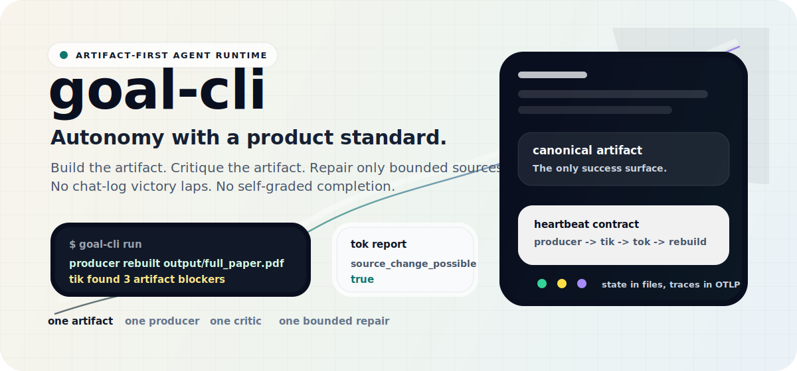
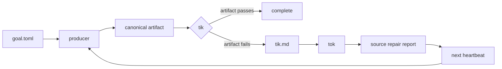

<div align="center">
  

  <h1>goal-cli</h1>

  <p><strong>Stop grading autonomous agents by chat logs. Grade the artifact.</strong></p>

  <p>
    <a href="https://github.com/SiyaoZheng/goal-cli"></a>
    
    
    
    
  </p>

  <p>
    <a href="#quick-start">Quick Start</a>
    <span> . </span>
    <a href="#why-this-is-different">Why Different</a>
    <span> . </span>
    <a href="#the-heartbeat">Heartbeat</a>
    <span> . </span>
    <a href="#configuration">Config</a>
    <span> . </span>
    <a href="#docs">Docs</a>
  </p>
</div>

---

Most agent runners celebrate activity: files edited, commands run, tokens
spent, plans updated. `goal-cli` is built around a harder standard:

> The goal is not complete until the canonical artifact is rebuilt and passes
> its evaluator.

Give `goal-cli` one artifact, one producer command, one critic, and a bounded
source surface. Each heartbeat rebuilds the artifact, lets `tik` judge only
that artifact, and lets `tok` repair sources only when the artifact fails. The
repair pass never gets to declare victory. Only a later rebuild and passing
artifact review can finish the goal.

## Quick Start

Install from this checkout:

```bash
python3 -m venv .venv
source .venv/bin/activate
python3 -m pip install --upgrade pip
python3 -m pip install -e .
```

Create a goal:

```bash
goal-cli init
$EDITOR goal.toml
goal-cli validate
goal-cli doctor
```

Run one heartbeat:

```bash
goal-cli run
goal-cli state
```

For model-based artifact critique:

```bash
python3 -m pip install -e '.[openai]'
export OPENAI_API_KEY="..."
goal-cli doctor
```

Use `goal-cli doctor --smoke-codex-goal` when setup should prove the internal
Codex `/goal` tok path too. Use `--skip-openai-auth` only when auth is supplied
outside the environment.

## Why This Is Different

`goal-cli` is not a generic task runner, a chat wrapper, or a todo loop. It is
an artifact runtime.

| Ordinary agent loop | `goal-cli` |
| --- | --- |
| "The agent says it improved the paper." | The PDF is rebuilt, opened by `tik`, and judged as the submitted artifact. |
| "The agent edited a benchmark script." | The benchmark result is regenerated and evaluated before the goal can pass. |
| "The agent made website changes." | The site artifact is produced first; source repair follows only from artifact critique. |
| "The run got long and state lived in chat." | State, prompts, ledgers, reports, locks, and traces live under `.goal/`. |
| "The repair pass declared success." | `tok` can only change sources; completion belongs to the next artifact review. |

This makes it useful for projects where the product is concrete:

- publication PDFs
- benchmark reports
- generated websites
- model checkpoints
- datasets and codebooks
- slide decks and long-form reports
- packages that must build and pass checks

## The Heartbeat



One `goal-cli run` executes one bounded heartbeat:

1. Load file-backed state and acquire a lock.
2. Run the producer command.
3. Verify the canonical artifact exists.
4. Run `tik` against the artifact and write `tik.md`.
5. If `tik` passes, mark the artifact-level goal complete.
6. If `tik` fails, launch one bounded `tok` source-repair pass.
7. Validate the tok JSON report, record state, and exit.

The design is intentionally asymmetric. `tok` is allowed to improve sources,
but it is not allowed to complete the goal directly. A later heartbeat must
rebuild the product and let `tik` judge the result.

## Configuration

A goal is one `goal.toml` file:

```toml
name = "paper-ready"
state_dir = ".goal"
runs_dir = ".goal/runs"

[artifact]
path = "output/full_paper.pdf"
copy_as = "full_paper.pdf"

[producer]
command = "make all"

[tik]
provider = "oracle"
command = "python3 scripts/tik.py"

[tok]
provider = "codex_goal"
write_dirs = ["writing", "src"]
sandbox = "workspace-write"
codex_features = ["goals"]

[safety]
generated_dirs = ["output", "build"]
max_blocker_repeats = 3
```

For a PDF-first research workflow:

```bash
cp examples/scientificity/goal.toml ./goal.toml
```

Then edit artifact paths, write scopes, model names, and the producer command
for that repository.

## Runtime Roles

| Role | Job | Hard boundary |
| --- | --- | --- |
| Producer | Rebuild the artifact from source | Must create `[artifact].path`. |
| Tik | Critique the artifact | Sees the product, writes `tik.md`. |
| Tok | Repair source files | Edits only configured `write_dirs`. |
| Heartbeat | Own liveness and state | Runs once, records, exits. |
| Git gate | Protect transitions | Optional no-mistakes checkpoint and review. |

Public `tik` modes:

- `oracle`: deterministic scripts, tests, metrics, or machine checks.
- `agent`: model-based artifact critique.

Production `tok` mode:

- `codex_goal`: launches an internal Codex `/goal` with a JSON Schema-checked
  final report.

## Command Deck

| Command | What it does |
| --- | --- |
| `goal-cli init` | Create a starter `goal.toml`. |
| `goal-cli validate` | Check config, artifact paths, and writable scopes. |
| `goal-cli doctor` | Check whether this goal can run end to end. |
| `goal-cli run` | Execute one autonomous heartbeat. |
| `goal-cli tik` | Run producer plus tik, but skip tok. |
| `goal-cli render-prompts` | Write rendered tik and tok prompts into a run directory. |
| `goal-cli state` | Print `.goal/state.json` or the default initial state. |
| `goal-cli reset` | Remove state and stale locks while preserving run artifacts. |

## Observability

OpenTelemetry tracing is enabled by default. Runtime spans cover the heartbeat,
producer, artifact load, tik, tok, and no-mistakes gate.

Default endpoint:

```toml
[observability]
service_name = "goal-cli"
endpoint = "http://localhost:4318/v1/traces"
timeout_seconds = 5
```

If no configured OTLP receiver is reachable and no OTLP endpoint was explicitly
set through the environment, `goal-cli` writes local fallback traces to:

```text
.goal/observability/traces.jsonl
```

For collector-managed local traces:

```bash
mkdir -p .goal/observability
cp docs/otel-collector-file.yaml .goal/observability/otel-collector.yaml
docker run --rm --name goal-cli-otel \
  -p 4318:4318 \
  -v "$PWD/.goal/observability:/observability" \
  -v "$PWD/.goal/observability/otel-collector.yaml:/etc/otelcol-contrib/config.yaml:ro" \
  otel/opentelemetry-collector-contrib:latest \
  --config=/etc/otelcol-contrib/config.yaml
```

## Git Gate

`goal-cli` can hand committed checkpoints to
[`kunchenguid/no-mistakes`](https://github.com/kunchenguid/no-mistakes).
The gate is enabled by default:

```toml
[no_mistakes]
enabled = true
binary = "no-mistakes"
mode = "lightspeed"
branch_prefix = "goal-cli"
```

When enabled, non-dry-run heartbeats start from a clean Git worktree. If the
repo is on the default branch, `goal-cli` creates a `goal-cli/...` feature
branch. Runtime files under `.goal/` are excluded through `.git/info/exclude`.

`mode = "lightspeed"` uses no-mistakes with high-latency steps skipped. Use
`mode = "fast"` or `mode = "full"` when a branch needs stronger local or release
gates.

## Internal Shape

The implementation keeps four seams narrow:

| Seam | Responsibility |
| --- | --- |
| Git Gate | `NoMistakesGate` owns clean checkpoints, feature branches, skip presets, readiness flags, and `no-mistakes axi run`. |
| Heartbeat State | `HeartbeatRecorder` owns state, history, heartbeat emission, transitions, and no-mistakes state recording. |
| Tok Execution | `tok_execution` owns Codex `/goal` command construction, JSON Schema validation, prompt files, reports, and diagnostics. |
| Readiness and Telemetry | `doctor` and runtime share tok execution and `TelemetryExportPlan`, so setup checks describe the real path. |

## Development

```bash
python3 -m pip install -e '.[openai]'
python3 -m pip install pytest
python3 -m pytest -q
goal-cli --help
```

## Docs

- [Installing goal-cli](docs/installation.md)
- [goal.toml schema](docs/config-schema.md)
- [Artifact-centered design notes](docs/artifact-goal-notes.md)
- [Codex goal implementation report](docs/codex-goal-openai-implementation-report.md)
- [PDF-first example goal](examples/scientificity/goal.toml)
- [OpenTelemetry Collector file exporter config](docs/otel-collector-file.yaml)

## Status

`goal-cli` is early local tooling, currently published as version `0.1.0`.
It is useful when you already know the artifact, producer command, evaluator,
and writable source surface.

No license file is included yet. Add one before accepting external
contributions or using this as a dependency in another public project.
