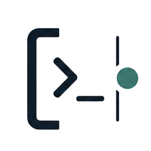

<!-- markdownlint-disable MD013 MD033 MD041 -->

<p align="center">
  
</p>

<h1 align="center">goal-cli</h1>

<p align="center">
  <strong>Make agents finish THE THING.</strong>
</p>

<p align="center">
  <a href="#快速开始"><strong>快速开始</strong></a>
  &nbsp;/&nbsp;
  <a href="#先说那个东西">那个东西</a>
  &nbsp;/&nbsp;
  <a href="#它做什么">它做什么</a>
  &nbsp;/&nbsp;
  <a href="#背后的科学">科学</a>
  &nbsp;/&nbsp;
  <a href="#technical-details">细节</a>
</p>

<p align="center">
  <a href="README.md">English</a>
  &nbsp;/&nbsp;
  <strong>中文</strong>
</p>

<p align="center">
  
  
  
  
</p>

Coding agent 很爱写代码。

但你要的不是代码。

你要的是那个东西。

不是 diff。

不是进度汇报。

不是“快好了”。

是那个东西。

PDF。

网站。

报告。

图表包。

App demo。

`goal-cli` 把那个东西放在中间。

它重建那个东西。

它检查那个东西。

如果那个东西还不够好，agent 才继续改源码。

聊天里的自信不算数。

那个东西算数。

## 快速开始

只复制这一句话给你的 coding agent。

```text
Hi, read https://github.com/SiyaoZheng/goal-cli/blob/master/llms.txt and do what it says.
```

就这样。

细节在 [`llms.txt`](llms.txt)。

Agent 去读。

你只看那个东西。

## 先说那个东西

<p align="center">
  
</p>

人不一样。

东西不一样。

规则一样。

先说清楚那个东西。

让 agent 一直回到它。

| 谁 | 人话 |
| --- | --- |
| 学者  | “给我看 PDF。” |
| 设计师  | “给我看海报。” |
| 玩家  | “我的 app 跑起来了吗？” |
| 会计  | “数字对得上吗？” |
| 分析师  | “图动了吗？” |

## 它做什么

一句 prompt。

一个东西。

每 30 分钟一次心跳。

| 动作 | 发生什么 |
| --- | --- |
|  | 重建那个东西。 |
|  | 检查那个东西。 |
|  | 只修允许改的源码。 |
|  | 下一次心跳再看。 |

问题不是：

“它改代码了吗？”

问题是：

“那个东西变好了吗？”

| 你在乎 | Agent 必须证明 |
| --- | --- |
| 论文 | PDF 重新生成了，而且值得读。 |
| 网站 | 页面能打开，而且看起来对。 |
| 报告 | 数字和叙事都能检查。 |
| 图表包 | 导出的图是新的。 |
| Demo app | App 跑在你要的状态。 |

## 背后的科学

现在大家叫它
[loop engineering](https://addyosmani.com/blog/loop-engineering/)。

热点说法是：

别写一个神奇 prompt。

设计一个循环。

让它运行。

让它检查。

让它再来。

`goal-cli` 是给普通人用的版本。

每次心跳只问一句：

那个东西变好了吗？

好了，就停。

没好，就修源码，30 分钟后再回来。

来源：[Addy Osmani](https://addyosmani.com/blog/loop-engineering/)、
[LangChain](https://www.langchain.com/blog/the-art-of-loop-engineering/)、
[ADTMAG](https://adtmag.com/articles/2026/07/01/loop-engineering-emerges-as-developers-put-ai-coding-agents-on-repeat.aspx)。

<details id="technical-details">
<summary><strong>技术细节</strong></summary>

配置文件是 `goal.toml`。

它只回答四个问题：

| 问题 | 配置 |
| --- | --- |
| 我要检查哪个成品？ | `[artifact].path` |
| 怎么重建它？ | `[producer].command` |
| 怎么检查它？ | `[tik]` |
| Agent 允许改哪里？ | `[tok].write_dirs` |

常用命令：

| 命令 | 用途 |
| --- | --- |
| `goal-cli init` | 创建 starter `goal.toml`。 |
| `goal-cli validate` | 检查配置。 |
| `goal-cli doctor` | 检查本地环境能不能跑。 |
| `goal-cli run --dry-run` | 先预演，不真的修。 |
| `goal-cli run --max-minutes 30` | 跑一次 30 分钟心跳。 |

完整配置说明见 [docs/config-schema.md](docs/config-schema.md)。

完整命令说明见 [docs/cli-reference.md](docs/cli-reference.md)。

</details>
